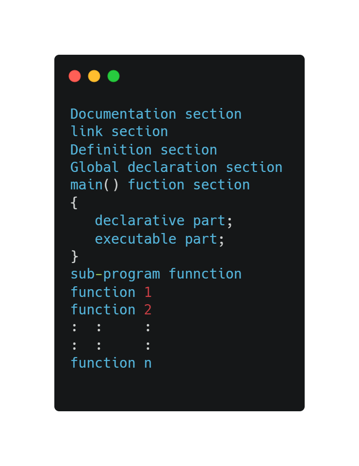
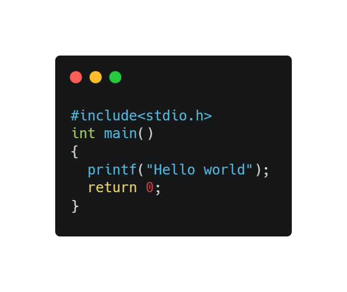

# `C-programming-practice-tasks`
> C is a powerful general-purpose programming language. It can be used to develop software like operating systems, databases, compilers, and so on. C programming is an excellent language to learn to program for beginners.

## `Basic structure of C`
  

### `Topics covered`
>- [x] Basic elements of c
>- [x] Input and output inbuild functions
>- [x] Operators and expression
>- [x] Control statements
>- [x] Arrays
>- [x] Function
>- [x] Pointers
>- [x] Structure and Union
>- [x] File handling in C
>- [x] Graphics basic

# `Practice programs`

#### `Basic elements of C`
S.N | PROGRAMS
----|---------
1|[Program to print 'Hello world'](https://github.com/Bibek117/C-programming-pratice-tasks/blob/main/Programs/1\)Basic%20elements%20of%20c/1.c)
2|[Program to display your short biodata using printf statement, (\n)-new line and (\t)-tab](https://github.com/Bibek117/C-programming-pratice-tasks/blob/main/Programs/1\)Basic%20elements%20of%20c/2.c)
3|[Comments in C](https://github.com/Bibek117/C-programming-pratice-tasks/blob/main/Programs/1\)Basic%20elements%20of%20c/3.c)
4|[program to add,subtract and multiply two numbers](https://github.com/Bibek117/C-programming-pratice-tasks/blob/main/Programs/1\)Basic%20elements%20of%20c/4.c)
5|[program to demostrate scanf() function and add,subtract,divide and multiply two numbers entered by user](https://github.com/Bibek117/C-programming-pratice-tasks/blob/main/Programs/1\)Basic%20elements%20of%20c/5.c)
6|[to take principle, time , rate from the user and calculate the simple interest ](https://github.com/Bibek117/C-programming-pratice-tasks/blob/main/Programs/1\)Basic%20elements%20of%20c/6.c)
7|[program to take three different radii and display respective area (Use symbol constant)](https://github.com/Bibek117/C-programming-pratice-tasks/blob/main/Programs/1\)Basic%20elements%20of%20c/7.c)
8|[program to demostrate use of  typedef keyword](https://github.com/Bibek117/C-programming-pratice-tasks/blob/main/Programs/1\)Basic%20elements%20of%20c/8.c)
9|[Program to demostrate use of enum keyword](https://github.com/Bibek117/C-programming-pratice-tasks/blob/main/Programs/1\)Basic%20elements%20of%20c/9.c)
10|[program to change temperature from centrigrade to fahrenheit](https://github.com/Bibek117/C-programming-pratice-tasks/blob/main/Programs/1\)Basic%20elements%20of%20c/10.c)

Prepared by - Bibek Angdembe  
✋Conncet to me through [Facebook](https://www.facebook.com/bibek.angdembay)
